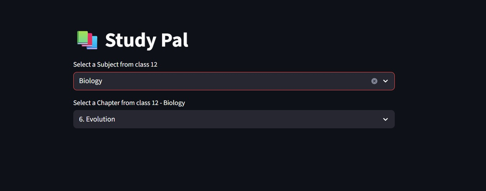
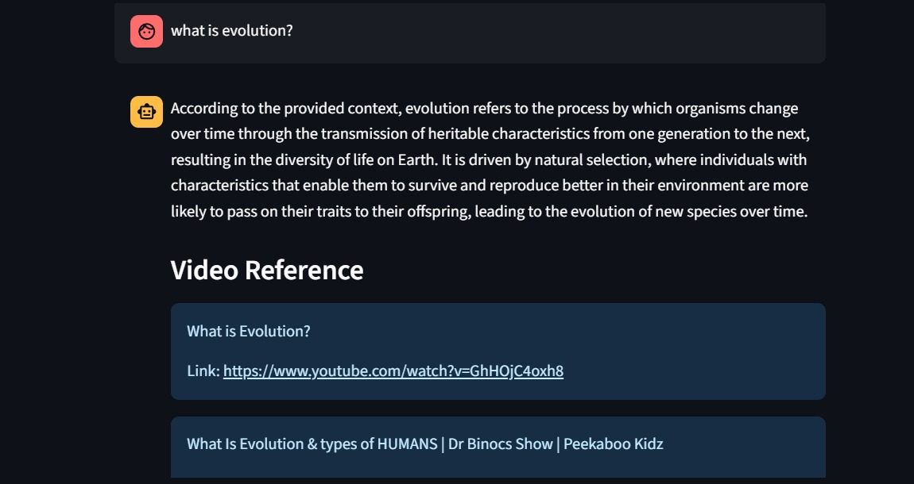

# 📚 Study With Me RAG – AI Study Assistant

---

## 🧠 Overview

**Study With Me RAG** is a Retrieval-Augmented Generation (RAG) based AI study assistant designed to help Class 12 students learn subjects like Biology and Mathematics through **context-aware question answering, semantic search, and intelligent summarization**.

It leverages **vector embeddings of textbook chapters** to deliver accurate, syllabus-aligned responses grounded in actual study material.

The system is **fully Dockerized** and has been **validated on AWS EC2**, while remaining lightweight enough for local execution.

---

## 🎯 Use Case

Students often struggle with:

* Finding precise answers in lengthy textbooks
* Revising specific chapters efficiently
* Understanding concepts using only static content

**Study With Me RAG solves this by enabling:**

* 📖 Asking questions from a specific chapter
* 🌐 Asking questions across the full syllabus
* 📝 Generating concise chapter summaries for revision
* 🎥 Accessing reference YouTube links for deeper understanding

---

## ✨ Key Features

* 📖 **RAG-based chatbot** grounded in Class 12 textbook content
* 🔍 **Semantic search** (chapter-wise + full syllabus)
* 🧠 **Context-aware answers** using vector embeddings
* 📝 **Automated chapter summarization**
* 🎥 **Reference links** for concept clarity
* 🐳 **Fully Dockerized application**
* ☁️ **Cloud deployment validated on AWS EC2**
* 🧩 Modular and extensible architecture

---

## 🧠 How It Works (RAG Pipeline)

```text
1. Textbook chapters are ingested and chunked  
2. Each chunk is converted into vector embeddings  
3. Embeddings are stored in a vector database  
4. User query triggers semantic retrieval  
5. Relevant context is passed to the LLM  
6. Final answer is generated with grounded references  
```

---

## 🏗 Architecture Overview

```text
User Query
   ↓
Vector Retriever
   ↓
Relevant Chapter Embeddings
   ↓
LLM + Context (RAG)
   ↓
Answer + References
```

---

## 🗂 Project Structure

```bash
study-with-me-rag/
│
├── chapters_vector_db/      # Chapter-wise vector databases
│   ├── 6. Evolution/
│   └── 12. Ecosystem/
│
├── data/                   # Raw textbook content
├── src/                    # Core application logic
├── vector_db/              # Combined vector database
│
├── requirements.txt
├── README.md
└── .gitignore
```

---

## 🛠 Tech Stack

* Python
* RAG-based LLM Architecture
* Vector Database
* LangChain / RAG Framework
* Docker
* AWS EC2
* Linux

---

## 🐳 Dockerization

The application is fully containerized using Docker, enabling:

* Consistent runtime environments
* Easy local execution
* Seamless cloud deployment

Docker images have been:

* Built locally
* Tested in isolated environments
* Successfully validated on AWS EC2

---

## ☁️ Cloud Deployment (Validated)

* Dockerized application tested on AWS EC2
* Verified container execution in Linux-based cloud environment
* Currently run locally to optimize cost efficiency

---

## 📸 Screenshots

### Chatbot Interface and Chapter Selection


### Sample Q&A Output


---

## 🚀 Future Enhancements

* 📚 Add more subjects (Physics, Chemistry)
* 📊 Student performance tracking and analytics
* 🎨 Improved UI (Streamlit / Web frontend)
* 🤖 Agentic RAG for multi-step reasoning workflows
* ⚙️ Distributed system support for large-scale evaluations

---

## ⭐ Support

If you find this project useful, consider giving it a ⭐ on GitHub!
